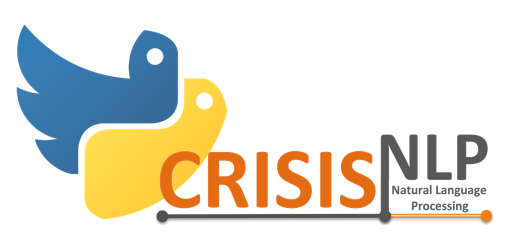
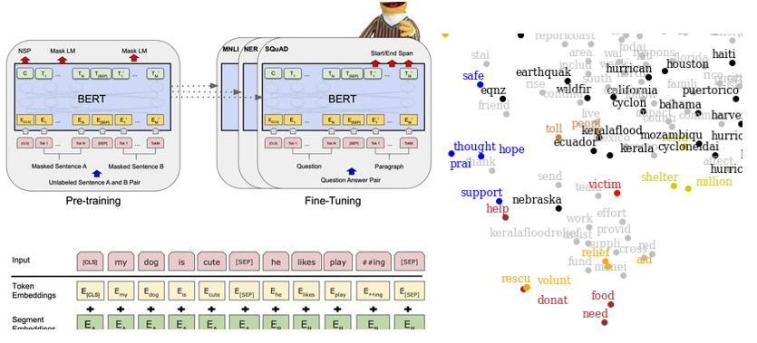

# Capstone Project:   &nbsp; &nbsp; What Remains of the Apocalypse
**Presented to you by Haizhou Liu, Di Lin and Li Zhou**

Welcome to the repo for our MADS Capstone project! In this repo, we are dedicated to **revealing the nature of disaster-related tweets** from different perspectives, including trend, network and the tweet contents themselves. With numerous data mining skills that MADS has imparted us, we are able to come up with many interesting findings. Enjoy!

*Figure Source: [Top 5 Business Continuity and Disaster Recovery Twitter Follows](https://solutionsreview.com/backup-disaster-recovery/top-5-business-continuity-and-disaster-recovery-twitter-follows/).*
 
**Table of Contents**

[TOC]

# On Code Reproducibility
Most of our codes are written in Jupyter Notebook for easier demonstration, and only a few are in the form of python scripts. All codes SHOULD BE reproducible, though, as long as you

1. Correctly install the packages as enumerated in the *requirements.txt* of each folder;

2. Download the dataset from [here]()(!!请更新) (which contains both our original and cleaned data), unzip it and put it under the *assets/*  folder.

3. Run the desired notebook in Google Colab (Pro preferred), if you are prompted to do so at the beginning of the notebook.

# A. Tweet Preprocessing

#### Introduction
Our disaster-related tweet corpus comes from the [HumAID dataset on CrisisNLP](https://crisisnlp.qcri.org/humaid_dataset.html), which contains a total of 77,196 tweets covering 19 worldwide disasters. For each tweet there is an also additional label indicating the category of the tweet content.

We further scraped additional information on the tweets (including time of tweet creation, number of likes/retweets, etc.) using [Tweepy](https://www.tweepy.org/) and the [Twitter API](https://developer.twitter.com/en/docs). 

#### Output
- Final datasets: *df_train_scraped_final.csv*, *df_valid_scraped_final.csv*, and *df_test_scraped_final.csv*.
Please also refer to Part B of our [BlogPost]() (!!请更新) for details.

#### Related Codes
- [./Preprocess-Tweet/Preprocess-tweet.ipynb](Preprocess-Tweet/Preprocess-tweet.ipynb): Merge and clean the massive source datasets.
- [./Preprocess-Tweet/Scrape-tweet.ipynb](Preprocess-Tweet/Scrape-tweet.ipynb): Scrape for more info of the tweets.

# B. Trends and Networks

#### Introduction
In this section, we aim to focus on **the statistical and network properties of the tweets**, while not relying on modern natural language analysis toolkits. More specifically, we attempt to answer the following questions:

1. What are the **temporal trends** of disaster tweets under different topics? Are there any similarities between tweet trends of the same/different disasters?

2. What are the **statistical properties** (e.g. number of words/ sentences/ likes/ retweets) of these tweets? Are these properties related to each other, and is there a trend for these properties?

3. Are there any **interesting patterns in the twittersphere network**?

#### Output
Please refer to Parts C and D of our [BlogPost]() (!!请更新) for our research findings.

#### Related Codes

# C. Supervised Learning

#### Introduction

#### Output
Please refer to Part E of our [BlogPost]() (!!请更新) for our research findings.

#### Related Codes

# D. Unsupervised Learning
(!!请更新图片)

#### Introduction

#### Output
Please refer to Part F of our [BlogPost]() (!!请更新) for our research findings.

#### Related Codes

# Acknowledgements
As the Capstone Project and our MADS program come to a close, we would like to give our sincerest thanks to the entire teaching group of UMSI-MADS. Your well-prepared courses and professional guidance have equipped us with the invincible power to conquer the world of big data. Thank you all, let us all keep calm and go blue!